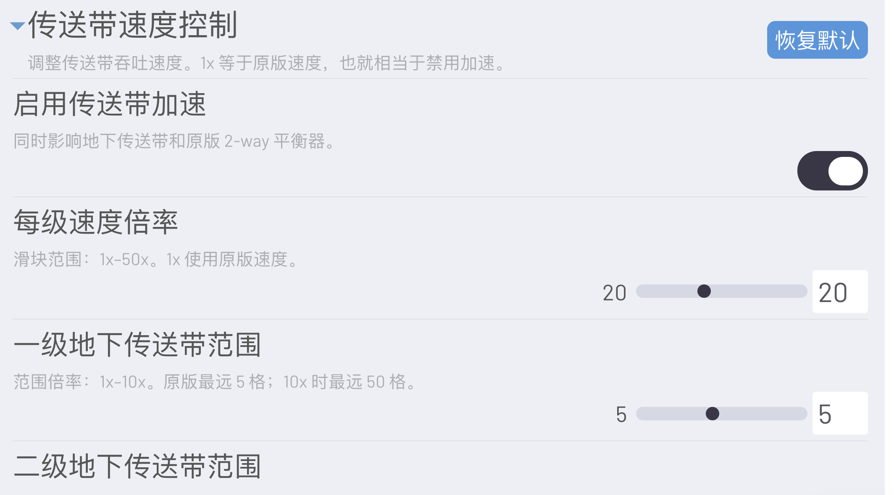
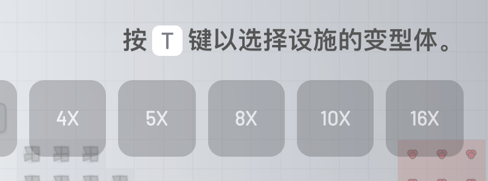

# shapez.io Mods Collection

> 面向 **shapez.io 一代** 的中文 Mod 整合包：物流扩展、快捷建造、原生设置页、地图预览与工厂性能压测。

[](https://ct-yx.github.io/shapez-mods/)
[](https://shapez.io/)
[](docs/mods/README.md)

**[前往项目主页](https://ct-yx.github.io/shapez-mods/)** · **[全部 Mod 介绍](docs/mods/README.md)**

本仓库中的 Mod 均为单文件 JavaScript：复制所需文件到游戏的 Mod 目录即可使用，不需要构建工具或第三方依赖。除来源不同的 Auto Tunnels 外，当前维护的 Mod 元数据要求游戏版本 `>=1.5.0`。


## 整合包内容

| 分类 | Mod | 一句话介绍 | 独立介绍 |
| --- | --- | --- | --- |
| 基础设施 | `structured-mod-settings.js` | 在游戏原生设置页提供统一的「游戏模组（MODS）」分类和持久化设置 API。 | [查看](docs/mods/structured-mod-settings.md) |
| 物流 | `belt_speed_10x.js` | 传送带 1–50× 调速，地下传送带距离独立设置，并同步原版平衡器与读取器。 | [查看](docs/mods/belt-speed-control.md) |
| 物流 | `balancer-variants.js` | 原版平衡器新增 4 / 5 / 8 / 10 / 16 路变形体。 | [查看](docs/mods/balancer-variants.md) |
| 建造 | `key-reform.js` | 使用 T/R + 数字键或滚轮快速切换变形体和朝向。 | [查看](docs/mods/key-reform.md) |
| 视图 | `zoomout-before-mapmode.js` | 放大进入地图总览前的缩放范围，并简化低缩放时的传送带渲染。 | [查看](docs/mods/zoomout-before-mapmode.md) |
| 性能 | `factory-stress-lab.js` | 无上限倍率、40 FPS 自适应 Benchmark、性能曲线与报告导出。 | [查看](docs/mods/factory-stress-lab.md) |
| 建造 | `auto-tunnels@1.0.4.js` | 方向锁定铺传送带时，自动尝试用地下传送带跨越现有物流。 | [查看](docs/mods/auto-tunnels.md) |
| 建造 | `extractor_chain.js` | 拖动时连续放置链式采矿机，并按路径自动调整朝向。 | [查看](docs/mods/chainable-extractors.md) |
| 测试 | `sandbox.js` | 解锁全部奖励并将蓝图成本归零，适合验证布局与压力测试。 | [查看](docs/mods/sandbox.md) |

## 安装

1. 前往[项目主页](https://ct-yx.github.io/shapez-mods/)获取由 GitHub 自动构建的最新整合包并解压。
2. 将需要启用的 `.js` 文件复制到游戏的 Mod 目录。
   - macOS 常用目录：`~/Library/Preferences/shapez.io/mods/`
3. 重启游戏，在 Mod 管理界面启用对应 Mod。
4. 启用了 `structured-mod-settings.js` 后，进入 **设置 → 游戏模组（MODS）** 配置支持设置项的 Mod。

> 每个文件可以单独使用。想要配置传送带速度、快捷键或地图预览时，同时启用 `structured-mod-settings.js`。

## 推荐组合

| 目标 | 推荐启用 |
| --- | --- |
| 日常建造 | `balancer-variants.js` + `key-reform.js` |
| 高吞吐物流测试 | `belt_speed_10x.js` + `balancer-variants.js` + `auto-tunnels@1.0.4.js` |
| 大地图规划 | `structured-mod-settings.js` + `zoomout-before-mapmode.js` |
| 工厂性能压测 | `factory-stress-lab.js`；搭建测试布局时可额外启用 `sandbox.js` |
| 全套体验 | 设置前置 + 物流 + 平衡器 + 按键 + 地图预览 + 压测工具；按需启用 Sandbox |

## 实机截图

<table>
  <tr>
    <td width="50%"><br><sub>传送带与地下传送带距离设置</sub></td>
    <td width="50%"><br><sub>T+数字键变形体映射</sub></td>
  </tr>
  <tr>
    <td><br><sub>4x 至 16x 的平衡器变形体</sub></td>
    <td><br><sub>地图总览缩放和低缩放渲染配置</sub></td>
  </tr>
</table>


## 兼容性与说明

- **Belt Speed Control** 调整物流吞吐；**Factory Stress Lab** 调整整体模拟倍率。二者可以叠加用于性能与吞吐对比。
- **Balancer Variants** 已包含多路平衡器，避免再与旧的独立 4-way / 8-way 平衡器 Mod 同时启用。
- **Sandbox** 会让所有奖励解锁、蓝图免费；建议使用独立测试存档，避免干扰正常进度。
- **Auto Tunnels** 和 **Chainable Extractors** 会扩展游戏建造器逻辑；若使用其他同类建造 Mod，建议先在测试存档验证组合效果。
- 低缩放时的传送带简化渲染仅影响视觉表现，不改变物流模拟。

## 报告示例

`Factory Stress Lab` 可输出 PNG、独立 HTML 和 TXT 三种报告格式。仓库保留了一组完整样本：

- [网页报告](reports/factory-stress-lab-sample.html)
- [文本报告](reports/factory-stress-lab-sample.txt)
- [PNG 报告原图](reports/factory-stress-lab-sample.png)

## 仓库结构

```text
shapez-mods/
├── mods/                  # 可直接复制到游戏 Mod 目录的单文件 Mod
├── docs/                  # GitHub Pages 展示站、独立 Mod 说明和截图资源
│   ├── index.html
│   ├── mods/
│   ├── assets/screenshots/
│   └── assets/download-latest.js
├── reports/               # Factory Stress Lab 报告样本
└── .github/workflows/     # GitHub Pages 自动部署工作流
```

## 发布展示站

仓库包含两个自动化工作流：

- `.github/workflows/pages.yml`：推送到 `main` 后部署 `docs/` 到 GitHub Pages。
- `.github/workflows/modpack-release.yml`：每次推送都会将当前的 `mods/*.js` 实时打包，并更新 `modpack-latest` GitHub Release 资产。展示页通过 GitHub API 读取该资产的最新下载地址，因此 ZIP 不会被提交到仓库。

首次使用时需在仓库 **Settings → Pages** 中把 Source 设为 **GitHub Actions**。

展示地址：<https://ct-yx.github.io/shapez-mods/>

## 支持项目

如果这些 Mod 对你的工厂有帮助，欢迎通过以下方式支持持续维护：

- [爱发电赞助](https://www.ifdian.net/a/Ct_yx?utm_source=copylink&utm_medium=link)
- [Buy Me a Coffee](https://buymeacoffee.com/ctyx)

## 致谢

- `Factory Stress Lab` 的速度控制原型受到 [Speed Control](https://mod.io/g/shapez/m/speed-control) 的启发；当前实现已按本项目的压测与报告需求重写。
- `Auto Tunnels` 文件保留其上游作者信息：erjiu、minimax 与 Sense_101。
- 本仓库由 ct-yx 与 Codex 共同维护。
