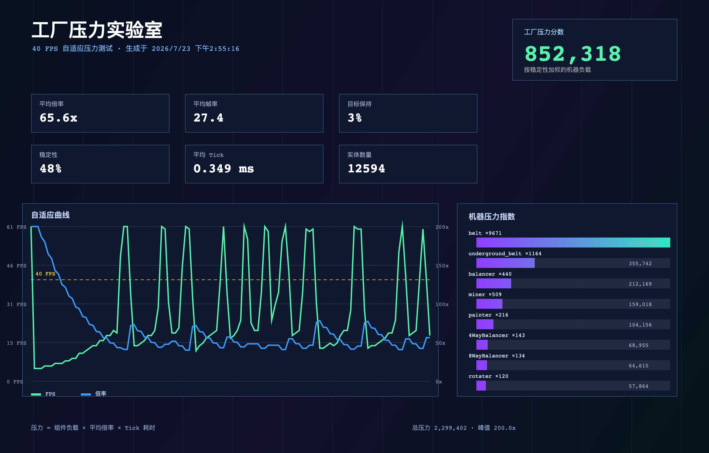
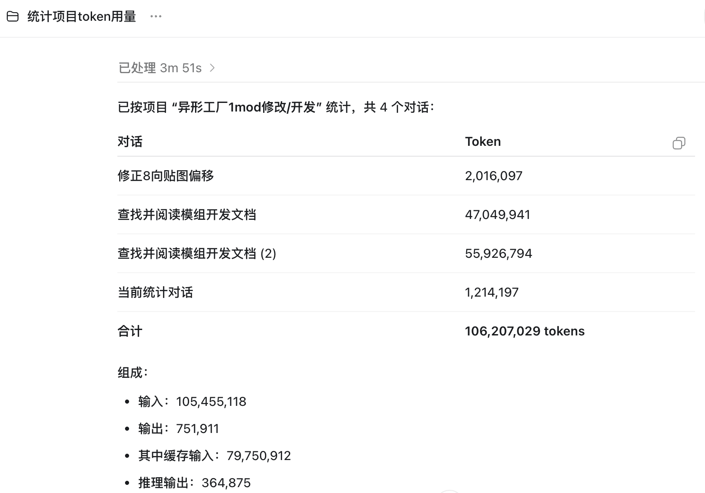

# shapez.io Mods

这是 ct-yx 与 Codex 共同整理和维护的 shapez.io 一代 mod 集合，集中整理了传送带加速、工厂压力测试和多向平衡器等工具。它们主要用于提升工厂搭建效率、测试工厂在高模拟倍率下的表现，以及扩展基础物流布局能力。

项目中的 mod 都采用单文件形式，复制到游戏的 mods 目录即可使用，不需要额外的构建工具或依赖。最低游戏版本为 `1.5.0`。其中 `Factory Stress Lab` 是当前持续维护和迭代的主 mod，其余文件是独立的小型功能 mod，可以按需启用。

## 致谢

`Factory Stress Lab` 的速度控制原型受到 [Speed Control](https://mod.io/g/shapez/m/speed-control) 的启发。当前实现已针对本项目需求重新设计并重写，加入了无限倍率、40 FPS 自适应 Benchmark、性能曲线、机器压力分析和多格式报告导出等功能；这里感谢原 mod 带来的思路。

## 项目特色

- **物流加速**：所有等级传送带和地下传送带统一提升 10 倍速度。
- **性能测试**：Factory Stress Lab 以约 40 FPS 为目标自动调节模拟倍率，并记录 FPS、逻辑耗时、实体数量、倍率和机器压力。
- **报告导出**：压力测试结果可以导出为 PNG、独立网页或纯文本报告。
- **布局扩展**：提供 4 向和 8 向平衡器，适合大型工厂的物流分流与合流。

## Mods

| 文件 | 功能 |
| --- | --- |
| `mods/belt-speed-10x.js` | 所有等级的普通传送带与地下传送带速度提升 10 倍 |
| `mods/factory-stress-lab.js` | 无限倍率控制、40 FPS 压力测试、性能曲线与 PNG/网页/文本报告导出；Benchmark 面板支持展开/收起 |
| `mods/structured-mod-settings.js` | 为其他 mod 提供可复用的结构化设置面板与持久化 API |
| `mods/zoomout-before-mapmode.js` | 地图总览缩放阈值示例 mod，使用结构化设置面板调节 |
| `mods/4-way-balancer.js` | 4 向平衡器 |
| `mods/8-way-balancer.js` | 8 向平衡器 |

## 功能介绍

### Belt Speed ×10

`belt-speed-10x.js` 修改游戏中传送带速度的基础计算逻辑：

- 普通传送带的每个升级等级都提升为原速度的 10 倍。
- 地下传送带的每个升级等级也同步提升为原速度的 10 倍。
- 保留原有的等级和升级关系，不额外添加建筑或改变存档结构。
- 适合快速测试大型物流网络，或减少早期工厂的等待时间。

### Factory Stress Lab

`factory-stress-lab.js` 是一个集模拟倍率控制和工厂性能分析于一体的工具，重点观察游戏模拟本身，而不是硬件温度或显卡参数。

#### 模拟倍率控制

- 支持 `1x`、`5x`、`20x` 快捷倍率。
- 支持直接输入任意正数倍率，不把 100x 作为最高限制。
- `Turbo` 是独立的高速模式，使用固定的 100x 目标倍率。
- 支持暂停、恢复，以及快捷键调整倍率：`Shift + T` 切换 Turbo，`[`/`]` 调低或调高倍率。

#### 游戏性能详情

点击面板顶部的 FPS 数字，可以展开游戏性能详情，查看：

- 游戏 FPS 与毫秒/帧。
- 逻辑 Tick 频率与平均 Tick 耗时。
- 当前模拟倍率和每秒逻辑步数。
- 实体数量和机器负载估算。
- 画面显示状态，以及高倍率时的画面刷新频率。
- FPS 与倍率曲线。

普通详情曲线只在详情面板展开时记录，收起后会清空；Benchmark 运行期间则保留独立的跑分数据。普通曲线最多保留 10 分钟，并以每秒一个样本的频率记录，以减少额外性能开销。

#### Benchmark 压力测试

Benchmark 页面默认收起，点击 `PRESSURE Benchmark` 标题即可展开或收起：

1. 选择 `120 s` 或 `900 s` 测试时长。
2. 点击 `Run Stress Test` 开始测试。
3. 测试从 `200x` 起步，根据游戏 FPS 自动调整倍率。
4. 控制器会在 FPS 偏低时回退倍率，在 FPS 高于目标时继续提高倍率，目标范围约为 40 FPS。
5. 测试完成后自动回到 `3x`，并计算平均倍率、峰值倍率、平均 FPS、目标保持率、稳定性、Tick 耗时和机器压力综合分数。

当倍率超过 `10x` 时，游戏画面显示限制为每秒刷新一次，但模拟逻辑和 Benchmark 采样继续运行。这样可以减少高倍率下重复绘制画面的开销，让测试更集中地反映工厂模拟能力。

#### 报告导出

测试结果支持三种导出格式：

- **PNG**：高分辨率视觉报告，包含参数卡片、FPS/倍率曲线和机器压力排行。
- **WEB**：独立 HTML 网页报告，可在浏览器中打开并查看曲线与原始样本。
- **TXT**：适合保存、比较和复制的纯文本报告。

机器压力指数会根据场上机器数量、组件类型、平均倍率和 Tick 耗时进行综合估算，用于比较不同工厂布局的压力，不代表硬件功耗测量值。

#### 报告示例

仓库中的 `reports/` 目录包含一次实际压力测试的完整导出结果：

- [网页报告](reports/factory-stress-lab-sample.html)
- [文本报告](reports/factory-stress-lab-sample.txt)
- [PNG 报告原图](reports/factory-stress-lab-sample.png)

示例 PNG 使用 2560×1640 分辨率，展示了平均倍率、平均帧率、目标保持率、稳定性、平均 Tick、实体数量、综合分数、自适应曲线和机器压力排行。



## 项目开发统计

以下是本项目在开发阶段的 token 使用统计截图，共计 4 个相关对话、`106,207,029` tokens：



统计组成：

- 输入：`105,455,118`
- 输出：`751,911`
- 其中缓存输入：`79,750,912`
- 推理输出：`364,875`

### 4-way Balancer 与 8-way Balancer

- `4-way-balancer.js` 提供 4 向平衡器。
- `8-way-balancer.js` 提供 8 向平衡器。
- 两者用于多路物流的分流与合流，适合大型工厂和高吞吐量布局。
- 两个文件保留各自的建筑配置与贴图资源，不依赖 `Factory Stress Lab` 或 `Belt Speed ×10`。

### Structured Mod Settings UI

`structured-mod-settings.js` 是一个可作为前置 mod 使用的设置 UI 库。它会在游戏右上角提供一个默认收起的 `Mod Settings` 面板，其他 mod 可以注册结构化字段：

- 布尔开关
- 数值滑块与数字输入框
- 下拉选项
- 文本输入
- 分组标题、说明文字和恢复默认按钮

设置会由前置 mod 统一保存，其他 mod 只需要注册定义并读取 API，不需要自己编写面板或实现持久化。

#### 其他 mod 的接入方式

确保 `structured-mod-settings.js` 先加载，然后在其他 mod 的 `init()` 中注册：

```js
const settingsApi = globalThis.ShapezStructuredSettings;
const settings = settingsApi && settingsApi.register({
    id: "my-mod",
    title: { en: "My Mod", zh: "我的 Mod" },
    description: { en: "Mod settings", zh: "模组设置" },
    fields: [
        {
            id: "enabled",
            type: "boolean",
            label: { en: "Enabled", zh: "启用" },
            default: true,
        },
        {
            id: "amount",
            type: "number",
            label: { en: "Amount", zh: "数量" },
            min: 0.1,
            max: 10,
            step: 0.1,
            default: 1,
            onChange: value => applyAmount(value),
        },
    ],
});

const amount = settings ? settings.get("amount") : 1;
```

完整示例是 `zoomout-before-mapmode.js`：它把地图总览阈值暴露为 `0.1–1.5` 的滑块，数值越小，进入地图总览模式越晚。没有安装前置 mod 时，该示例仍会使用默认值运行。

## 安装

将需要使用的 `.js` 文件复制到游戏的 mods 目录：

```text
~/Library/Preferences/shapez.io/mods/
```

启动游戏后，在 mod 管理界面启用对应 mod。修改 mod 文件后需要重启游戏。

## 推荐组合

- **普通建厂**：只启用需要的平衡器 mod。
- **快速物流测试**：启用 `Belt Speed ×10`。
- **性能跑分**：启用 `Factory Stress Lab`，选择 Benchmark 时长后运行压力测试。
- **统一设置**：同时启用 `Structured Mod Settings UI` 和 `Zoom out before Mapmode`，在右上角 `Mod Settings` 面板中调节地图总览阈值。
- **物流与性能联合测试**：同时启用 `Belt Speed ×10`、平衡器和 `Factory Stress Lab`，对比不同布局的平均倍率与机器压力分数。

## 文件结构

```text
shapez-mods/
├── README.md
└── mods/
    ├── 4-way-balancer.js
    ├── 8-way-balancer.js
    ├── belt-speed-10x.js
    ├── factory-stress-lab.js
    ├── structured-mod-settings.js
    └── zoomout-before-mapmode.js
```

## 兼容性与注意事项

- `factory-stress-lab.js` 是当前维护版本，包含 Benchmark 展开按钮修复。
- `structured-mod-settings.js` 应在使用它的其他 mod 之前加载；在本目录中它会按文件名自然排在 `zoomout-before-mapmode.js` 之前。
- `belt-speed-10x.js` 只修改传送带基础速度，不改变存档数据。
- 高模拟倍率可能让游戏逻辑负载明显增加；首次测试建议从 `120 s` 开始。
- Benchmark 页面默认收起，不运行压力测试时不会持续记录 Benchmark 曲线。
- 如果游戏更新后 mod 行为异常，请先确认游戏版本与 `minimumGameVersion`，再重新复制最新文件。

## 版本说明

本仓库用于保存和同步本地 mod 文件及其说明。每个 mod 都可以单独复制使用，修改一个文件不会自动修改其他 mod。
