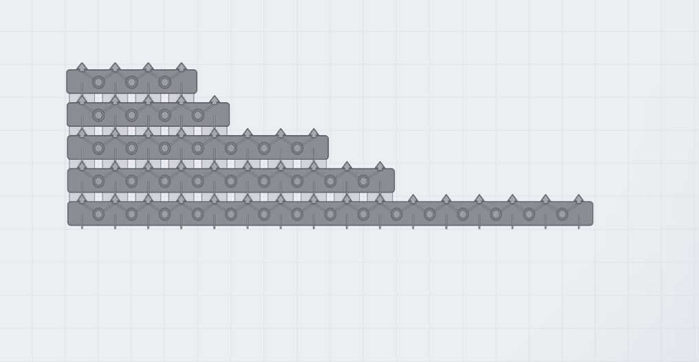

# Balancer Variants

> 在原版平衡器的变形体列表中增加 4、5、8、10、16 路版本。

- **分类：**物流
- **版本：**1.0.4
- **文件：**[`balancer-variants.js`](../../mods/balancer-variants.js)

## 用途

多路平衡器作为原版 balancer 的变形体出现，而不是新的工具栏建筑。选择原版平衡器后按 T 即可切换，扩展版本按实际宽度占用 N×1 格。

## 核心功能

- 保留原版 2-way、合流器与分流器，同时加入 4 / 5 / 8 / 10 / 16 路平衡器。
- 每个输入槽的物品轮流分配到可用输出槽。
- 总吞吐按原版 2-way 平衡器的 N / 2 线性扩展，并自动读取原版的处理速度。
- 配合 Belt Speed Control 时，多路版本会自动获得相同的速度倍率。
- 变形体选择条使用紧凑的 4x、5x、8x、10x、16x 文字标签。

## 使用方法

1. 选择原版平衡器后按 T 打开变形体列表。
2. 选择符合输入/输出总线宽度的版本后，按其 N×1 占地规划空间。
3. 启用 Key Reform 后可直接使用默认的 T+4、T+5、T+8、T+0、T+6 映射。

## 实机截图

原版平衡器的变形体条中直接显示 4x–16x。

不同宽度的平衡器按 N×1 格实际占地。

## 兼容性与注意事项

- 不要与旧版独立 4-way / 8-way 平衡器 Mod 同时启用，以免重复注册。

[← 返回项目 README](../../README.md) · [在线展示页](https://ct-yx.github.io/shapez-mods/mods/balancer-variants.html)
