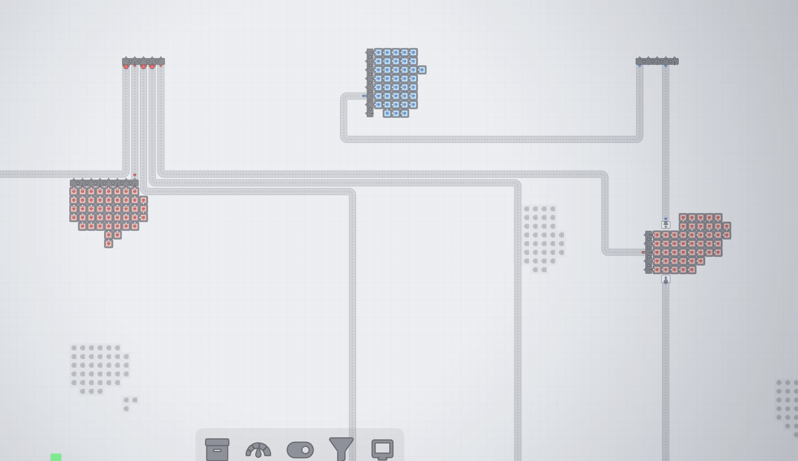
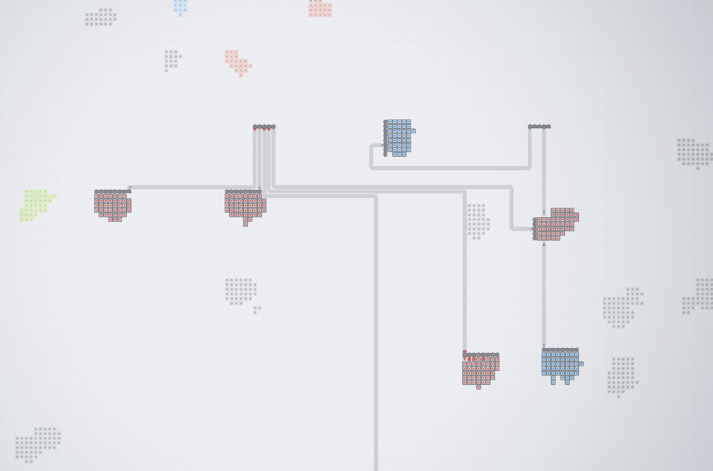

# Zoom out before Mapmode

> 扩大进入地图总览前的缩放范围，并在低缩放时简化传送带绘制。

- **分类：**视图
- **版本：**1.5.1
- **文件：**[`zoomout-before-mapmode.js`](../../mods/zoomout-before-mapmode.js)

## 用途

这个 Mod 面向大工厂规划：可以在进入地图总览之前看得更远，同时降低远距离观察时传送带物品和动画箭头带来的绘制负担。

## 核心功能

- 进入地图总览前的缩小范围可设置为原版的 1–8×，默认 2×。
- 默认实际镜头缩放达到 0.5× 或以下时，仅绘制每条传送带路径的首尾物品。
- 简化模式中的传送带使用无动态箭头的静态底图。
- 鼠标靠近端点物品会放大显示；相邻的同类端点会合并，避免视觉堆叠。
- 配置依据 camera.zoomLevel，而不是 1× / 5× / 100× 的模拟倍率。

## 使用方法

1. 启用 Structured Mod Settings UI 后，在「地图总览缩放」卡片中调整范围和简化阈值。
2. 对超大型工厂建议保持「低缩放时简化传送带物品」开启。
3. 如果只想恢复原版地图范围，将预览范围设置为 1×。

## 实机截图

可单独设置进入地图总览前的缩小范围与低缩放渲染阈值。

较近视角下仍可辨认主要物流线路。

远视角适合检查大型工厂中各分区与长距离物流的连接。

## 兼容性与注意事项

- 该 Mod 不改变普通建造镜头的最小缩放限制，只调整进入地图总览前的阈值。

[← 返回项目 README](../../README.md) · [在线展示页](https://ct-yx.github.io/shapez-mods/mods/zoomout-before-mapmode.html)
